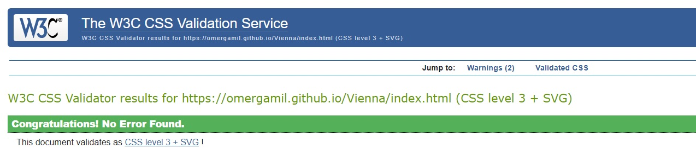

# Vienna Website
The Vienna website is a website that contains information about the beautiful city of Vienna. It targets everyone who wants to spend their vacation in the most beautiful city in the world or even plans to move there.

Users of this website will be able to find information about the city, its history, important government contacts and important tourist places. There is also a contact page with the founder of the site. The site is responsive to all screen sizes.

* Navigation Bar
    -   Featured at the top of all three pages, the navigation links are situated to the right. 
    -  On larger screens they show the text; Home, Services and Contact. On smaller screens, such as mobiles, the navigation links are situated in the burger-icon that expands when you click it.

## Features
* Navigation Bar
    -   Featured at the top of all three pages, the navigation links are situated to the right. 
    -  On larger screens they show the text; Home, Services and Contact. On smaller screens, such as mobiles, the navigation links are situated in the burger-icon that expands when you click it.
    -  At the top left in the header section, there is the city logo, that will take the user to the home page when clicked.

* The Home page
    -   This is the landing page and with it's colourful and inviting picture of the City from top view, it aspires to bring motivation to the user to take the step towards visiting the city.

    -   The section below contains information about the city, its history, major government places and contact numbers.

* The Footer
    -   The footer section includes relevant links to Facebook, Instagram , Youtube and some official websites.
    -   The links will open in a new tab and they aspire to give the user more motivation to take the travelling step.

* The To See In Vienna page
    -   The To See In Vienna page gives the user information on what places he can visit in Vienna

* The Contact page
    -   Background picture of the parlment of Austria.
    -   Contact form that allows the user to fill in the necessary contact details to easy get in touch.
    
    

## Testing
-   Accessibility
    -   I ran the pages through Lighthouse and confirmed that the colors and fonts are easy to read and that the site is accessible.
    
    
 
-   I tested and confirmed that the page works in different browsers; Chrome, Safari and Firefox.
-   I tested and confirmed that all internal links are working and redirecting the user between the pages.
-   I tested that all external links, to social media sites, are woking and opening in a separate tab.
-   I tested and confirmed that the contact form works, all fields are required, the email field only accepts email address, and the submit button link works:

-   HTML
    -   No errors found when running the code through the [W3C HTML Validator](https://validator.w3.org/)

-   CSS
    -   No errors found when running the code through the [W3C CSS Validator](https://jigsaw.w3.org/css-validator/) 

## Bugs
-   There was a bug causing error when submitting the form because of the action method.
I solved it by just typing the Code Institute link we used to use it with the form throughout the course.

### Unfixed bugs
-   No unfixed bugs

## Deployment

### Version Control
-   The site was created using Gitpod editor and pushed to Github to the remote repository 'Vienna'.
-   Git commands were used throughout the development to push the code to the remote repository. The following git commands were used:
    -   git add . - to add the files to the staging area before being committed.
    -   git commit -m "commit message" - to commit changes to the local repository queue that are ready for the final step.
    -   git push - to push all committed code to the remote repository on Github.

### Deployment to Github pages
-   The site was deployed to Github pages as follows:
    -   In the Github repository, I navigated to Settings tab
    -   From the source section drop-down menu, I selected the Master branch and Save
    -   Once the Master branch was selected, the page provided the link to the website
-   The live link: [Vienna site](https://omergamil.github.io/Vienna/)

### Cloning of the Repository Code locally
-   Go to the Github repository that you want to clone
-   Click on the Code button located above all the project files
-   Click on HTTPS and copy the repository link
-   Open the IDE of your choice and and paste the copied git url into the IDE terminal
-   The project is now created as a local clone

## Credits
-   A special thanks to my Mentor for the support and answering all my Questions!

### Content
-   The icons in the footer and in the headings were taken from [Font Awesome](https://fontawesome.com/)
-   I took inspiration from the Love Running project to create the header.

### Media
-   All the images in the website was taken from [Unsplash](https://unsplash.com/)